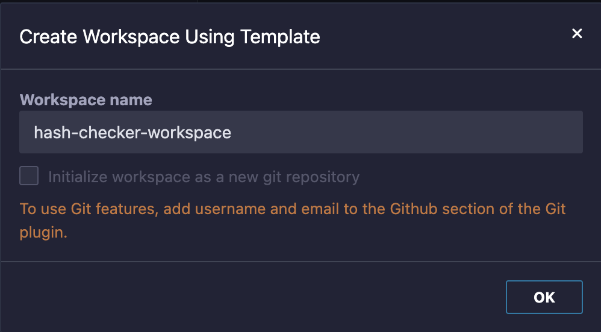

Follow these steps to create the Hash Checker workspace in Remix-IDE.

### Step 1: Access the Workspace Templates

1. In the **File Explorer** sidebar, click on the **hamburger menu icon** (three horizontal lines).

   

2. Select **"Create Using Template"** from the dropdown.

   

### Step 2: Find the Hash Checker Template

1. In the main panel, scroll down to the **"Circom ZKP"** section.

   

2. Locate the **"Hash Checker"** item.

### Step 3: Create the Workspace

1. Click on the **"Create"** button on the Hash Checker item.

   

2. In the modal pop-up, provide a **workspace name** (e.g., `hash-checker-workspace`).

   

3. Click **"OK"** to create the template.

### Result

- The workspace is created with the necessary files and directories.

   