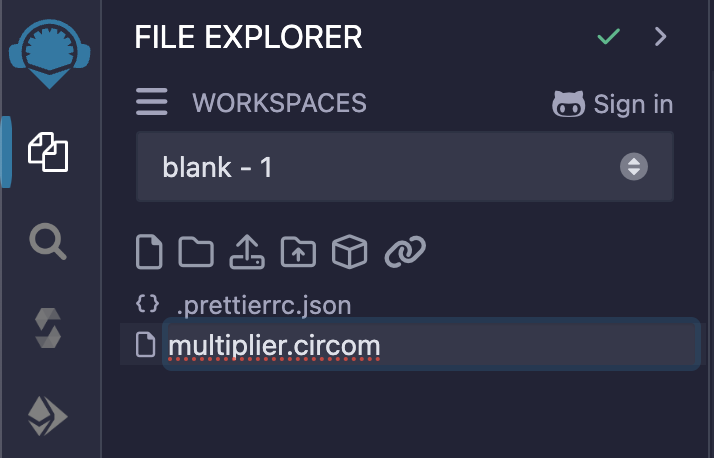

# Writing Your First Circom Circuit

[Back to Step 2](../step-2/README.md)

---

Now that you have the Circuit Compiler plugin installed, let's write a simple Circom circuit.

## Creating a New Circuit File

1. In the **File Explorer** on the left sidebar, click on the **Create New File** icon.
2. Name your file `multiplier.circom` and press **Enter**.



## Writing the Circuit

Open `multiplier.circom` and add the following code:

```circom
template Multiplier() {
    signal input a;
    signal input b;
    signal output c;

    c <== a * b;
}

component main = Multiplier();
