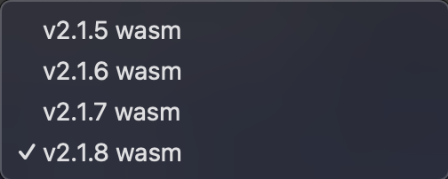
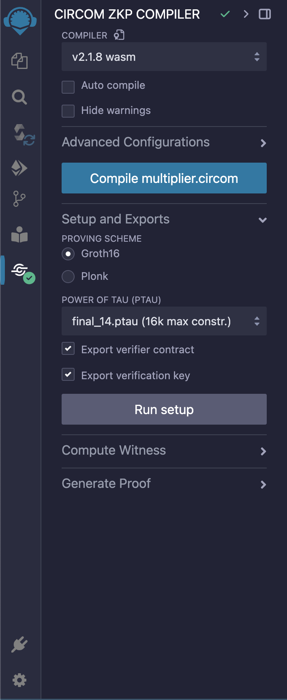

---

## Step 4: Compiling the Circuit Using the Plugin

```markdown
# Compiling the Circuit Using the Plugin

[Back to Step 3](../step-3/README.md)

---

With your `multiplier.circom` circuit ready, it's time to compile it using the Circuit Compiler plugin.

## Selecting the Compiler Version

1. Go to the **Circuit Compiler** plugin in the sidebar.
2. Choose the desired **Compiler Version** from the dropdown menu. For this tutorial, select the latest stable version.



## Configuring Compilation Options

- **Auto Compile:** You can enable this option to automatically compile your circuit whenever you save changes.
- **Hide Warnings:** Enable this to suppress compiler warnings if any.
- **Advanced Configuration:**
  - Click to expand.
  - Select the **Prime Field**. For most cases, `BN128` is sufficient.


## Compiling the Circuit

1. Click on the **Compile** button.
2. The compiler will process your circuit.
3. If successful, you'll see a compilation success message.



**Note:** If there are any errors, they will be displayed in the console. Check your code for typos or syntax errors.

## Understanding the Compilation Output

- After successful compilation, the **Setup and Exports** section becomes visible.
- You can proceed to the next step to perform a trusted setup.

In the next step, we'll perform a trusted setup using the compiled circuit.
