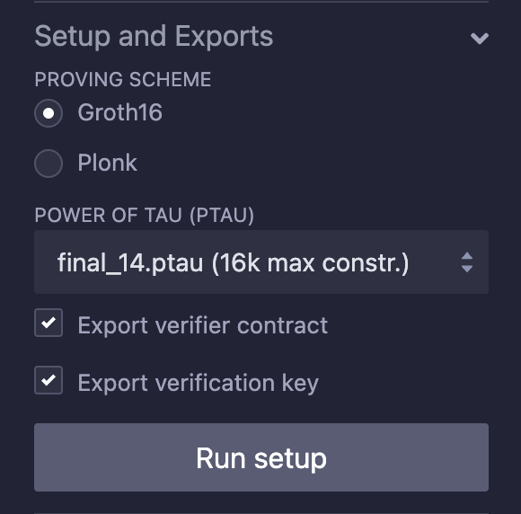

# Performing a Trusted Setup

[Back to Step 4](../step-4/README.md)

---

After compiling your circuit, you need to perform a trusted setup to generate proving and verification keys.

## Understanding Trusted Setup

- **Trusted Setup:** A process required for zk-SNARKs to generate the necessary parameters for proof generation and verification.
- You can choose between different protocols like **Groth16** and **Plonk**.

## Performing the Trusted Setup

1. In the **Setup and Exports** section, select the **Protocol**:
   - Choose between **Groth16** or **Plonk**. We'll use **Groth16** for this tutorial.
2. Choose the appropriate **Power of Tau** file from the dropdown. This file is necessary for the trusted setup.
   - If unsure, select the default option.
3. Click on the **Setup** button to start the trusted setup process.

## Exporting Keys

After the setup is complete:

- You can **Export Verification Key** to get the verification parameters.
- You can **Export Verification Contract** if you intend to verify proofs on-chain.

**Note:** The trusted setup may take some time, depending on the complexity of your circuit.

In the next step, we'll compute the witness for our circuit.
