# Presentation (record and replay contract deplyment and interaction)

## 0. load gist with files from terminal

## 1. open and compile `Escrow.sol`
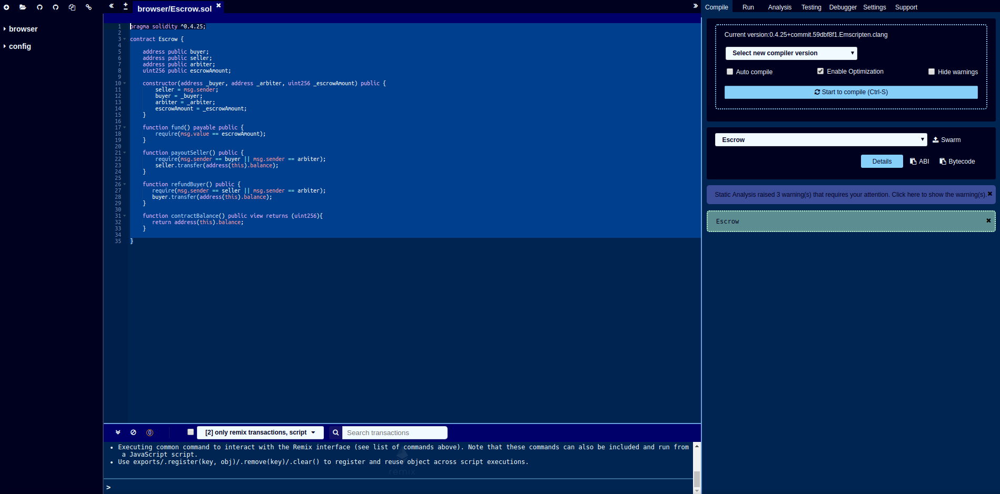

## 2. switch to run tab and check constructor
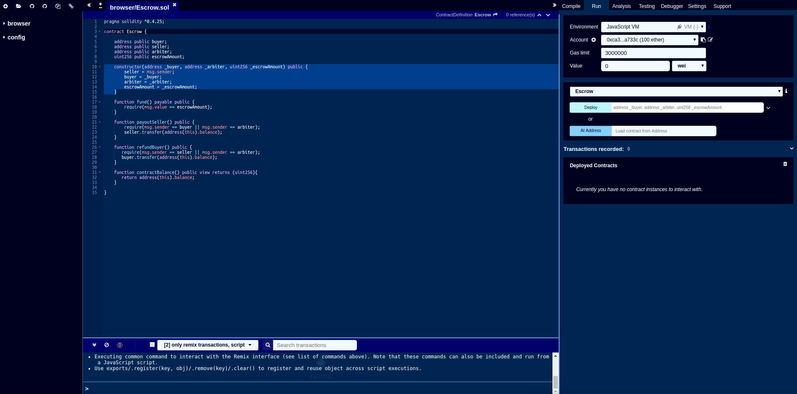

## 3. convert `0.3` ether to wei for `escrowAmount` parameter
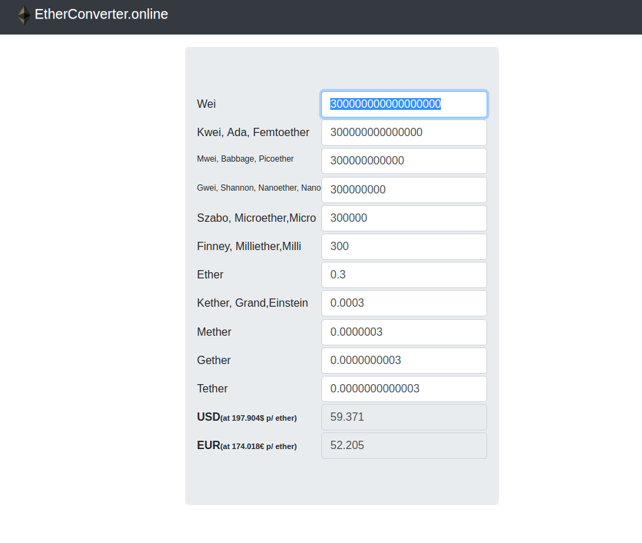

## 4. drop down Escrow constructor form, fill out arguments and deploy (`transact`)

## 5. check some fields to see `contractBalance` is 0
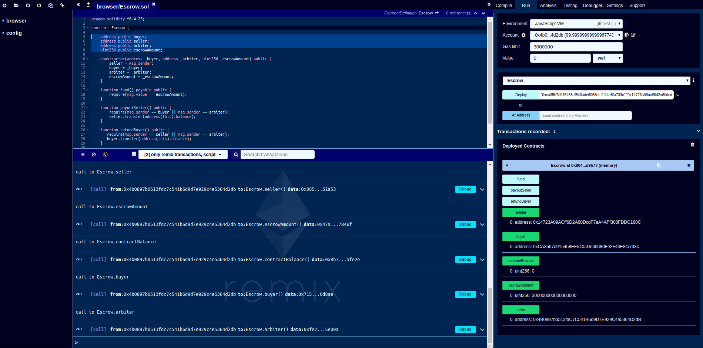

## 6. switch to `buyer` address, set "Value" to `0.3` and select `Ether`, then click `fund`
* `0.3` Ether have been sent to the escrow contract instance
* After you click fund, the "Value" field will be reset to 0
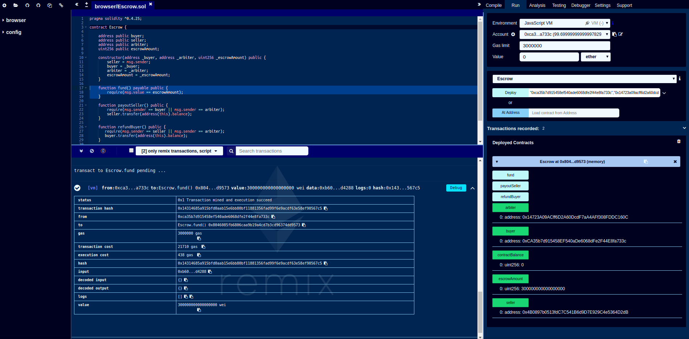

## 7. click `contractBalance` to see it has changed from 0 to 300000000000000000
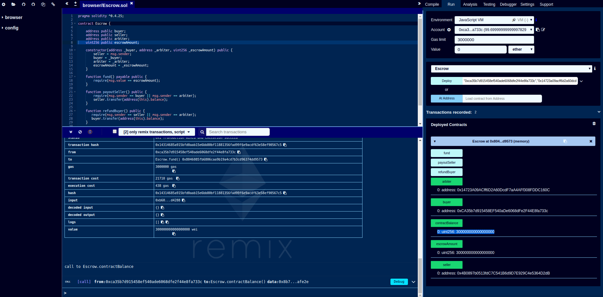

## 8. try to `refundBuyer` and see it fail
* Because the contract defines that you as the buyer cant refund
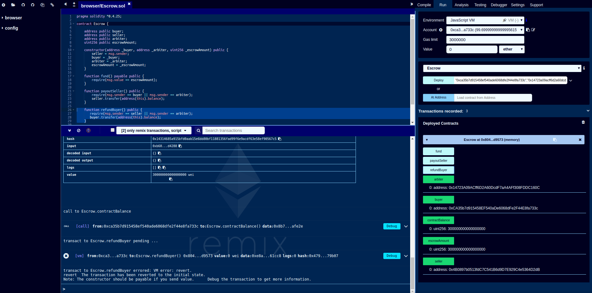

## 9. switch to `seller` address and try to `payoutSeller` and see it fail
* Because the contract defines that you as a seller cant payout
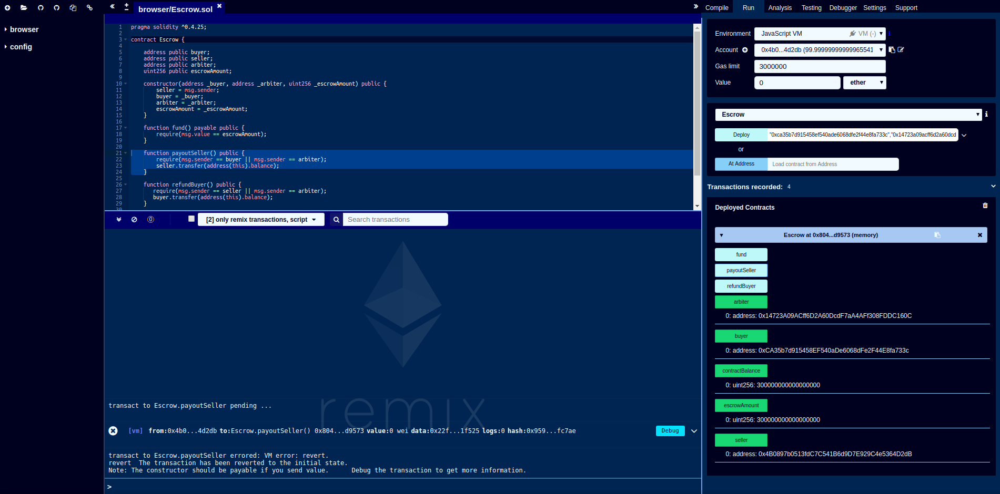

## 10. switch to `arbiter` address and decide to cancel by `refundBuyer`
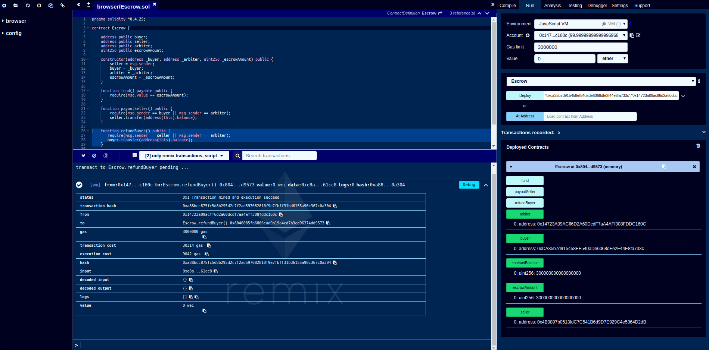

## 11. check `escrowAmount` and see it has changed from 300000000000000000 to 0
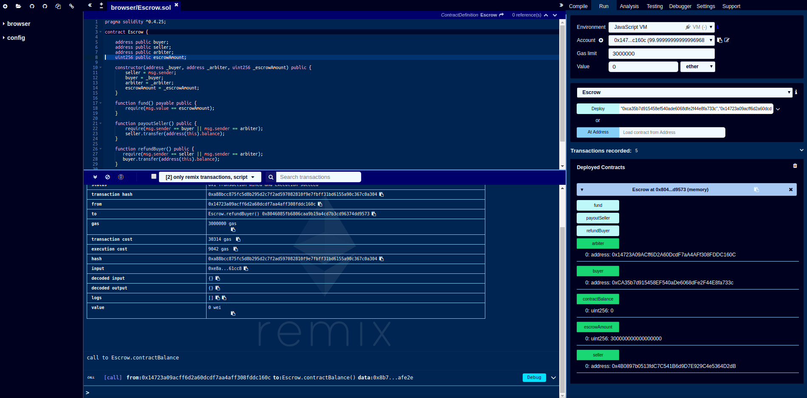

## 12. Go to "Transactions recorded" and click the dropdown and "save icon"
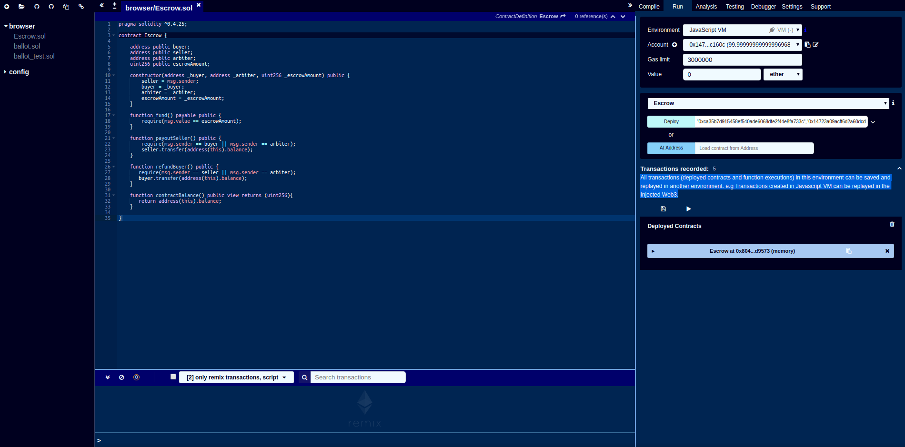

## 13. choose file name and click ok
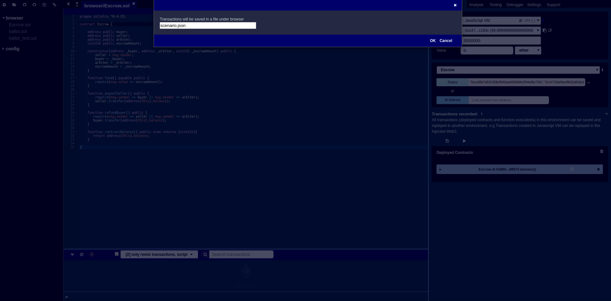

## 14. see the saved recording json file
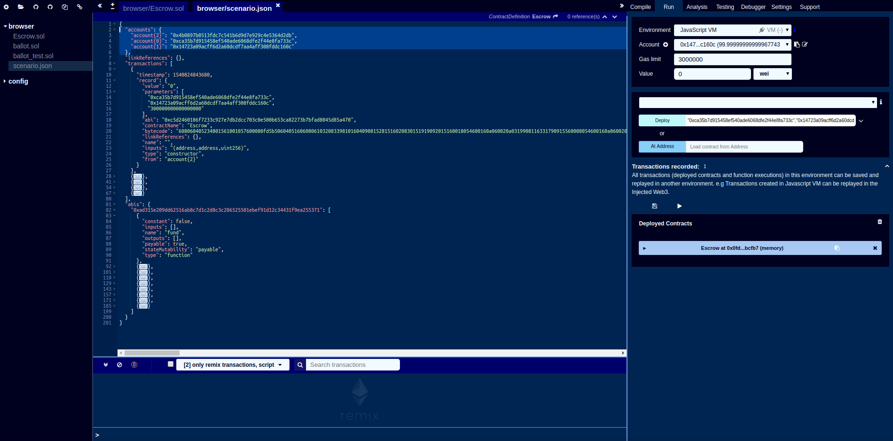

## 15. for example change addresses and constructor params and click PLAY to replay
* see all 5 transactions repeat with the changed data
* see another instance of the newly deployed contract
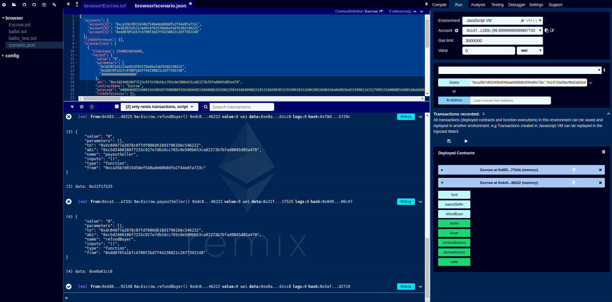

## 16. check all read only methods and see values have the changed ones
* contractBalance is 0 because everything has already been refunded to the buyer by arbiter
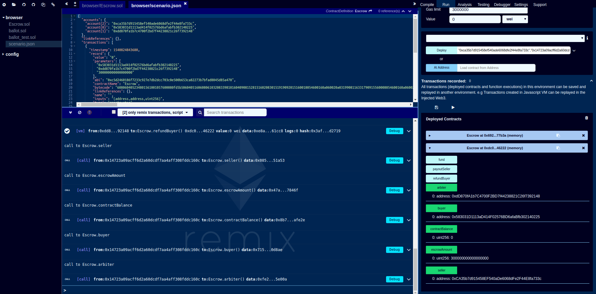

