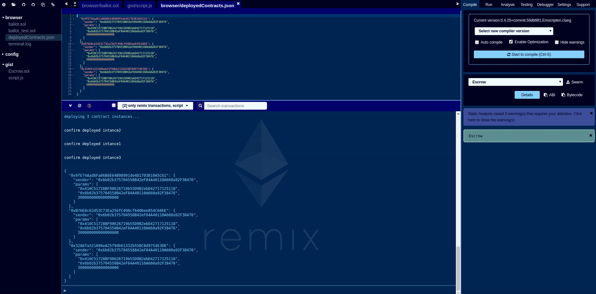

# Presentation (how to script contract deployment and contract interaction)

Deploy many contract instances of the same contract with different constructor inputs

## 1. load gist with files from terminal

## 2. execute script

## 3. see `deployedContracts.json` to see result

